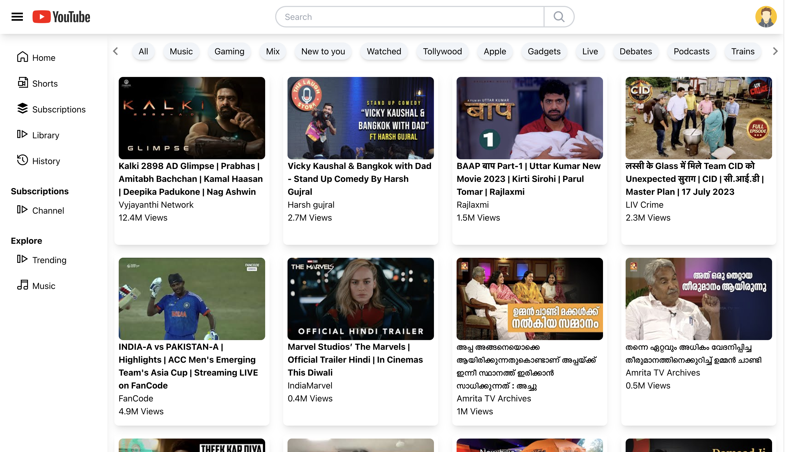
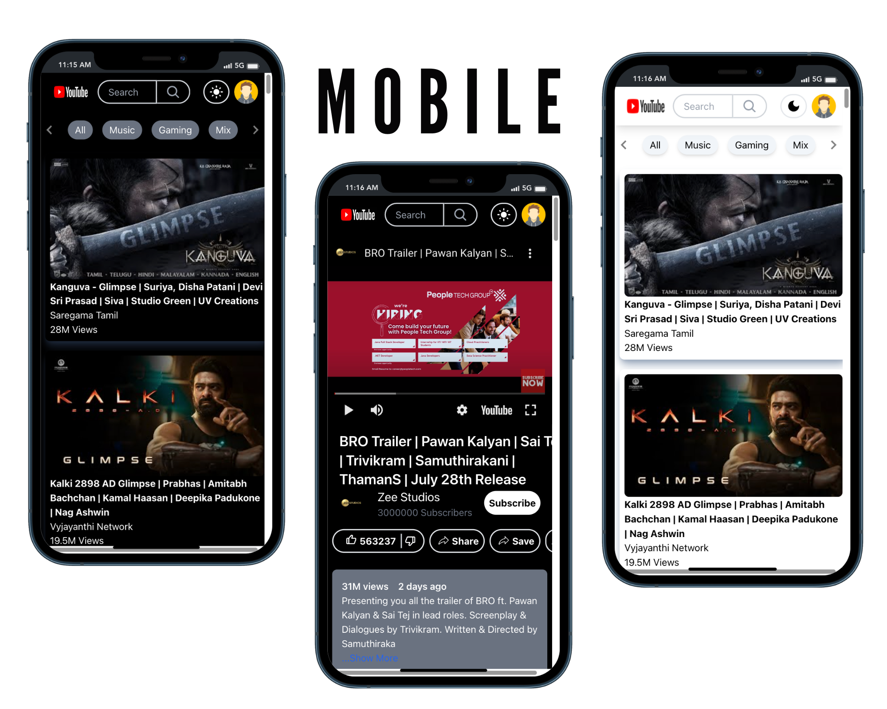
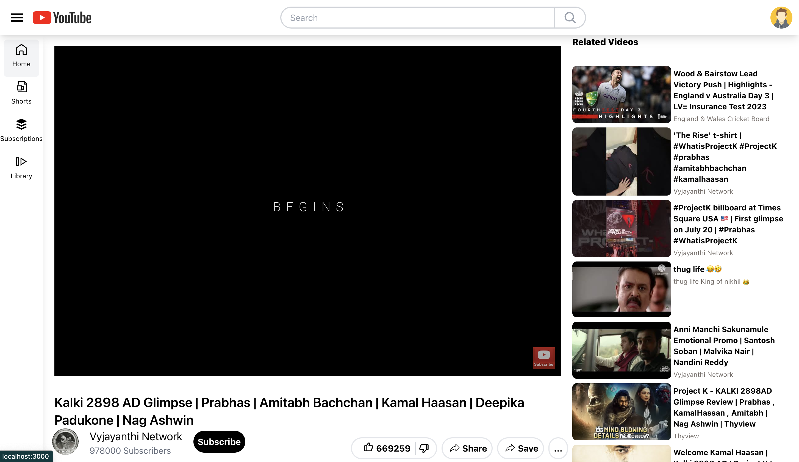
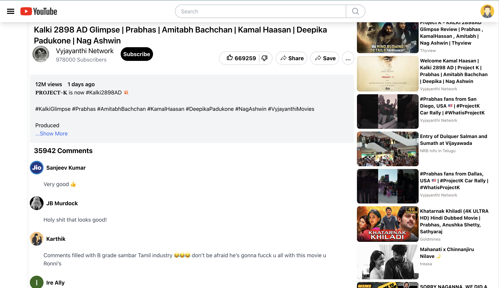
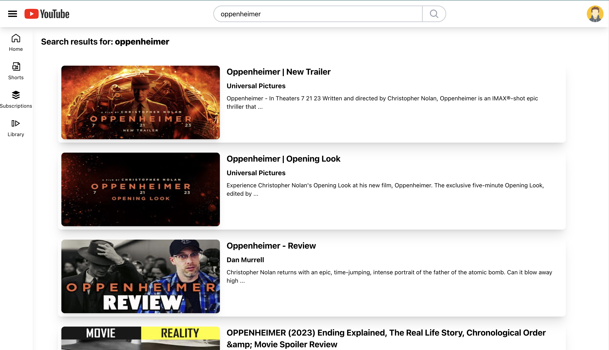

# Getting Started with my YouTube App

`Youtube clone project`

## Home Web Version

## Home Mobile Version

## Videos

## Comments

## Search Videos

## Technical Details

  
  
  
  
   
  
  

Here are some of the key skills I possess:

- Front-end development: HTML, CSS, JavaScript, React, Angular.
- UI/UX design principles for engaging user experiences.
- Git for version control and GitHub collaboration.
- Problem-solving and analytical thinking.

## `Key Features:`

- ✅ Real-time data fetching with the YouTube Data API.
- ✅ Smooth user experience with global state management powered by Redux.
- ✅ Beautiful and responsive design crafted using Tailwind CSS.
- ✅ Faster and smarter searches with integrated Google search suggestion API.
- ✅ Efficient display of search suggestions using Debouncing technique.
- ✅ Enjoy a Dark Theme and Light Theme for personalized viewing.
- ✅ Responsive design optimized for both web and mobile devices.

## Available Scripts

In the project directory, you can run:

### `npm start`

Runs the app in the development mode.\
Open [http://localhost:3000](http://localhost:3000) to view it in your browser.

The page will reload when you make changes.\
You may also see any lint errors in the console.

### `npm run build`

Builds the app for production to the `build` folder.\
It correctly bundles React in production mode and optimizes the build for the best performance.

The build is minified and the filenames include the hashes.\
Your app is ready to be deployed!

See the section about [deployment](https://facebook.github.io/create-react-app/docs/deployment) for more information.
